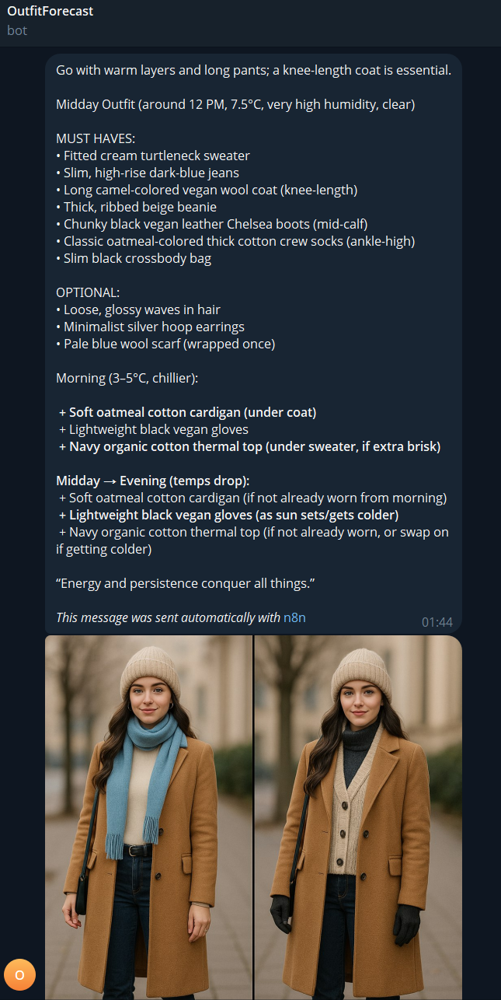

# OutfitForecast (n8n)

AI-powered weather-based outfit recommendation workflow built with n8n.

<table>
<tr>
<td width="60%" valign="top">

## What it does

- Fetches weather data (OpenWeatherMap)
- Generates outfit details using an LLM
- Generates a short human-readable summary
- Creates an outfit image (with retries)
- Sends summary + image via Telegram
- Includes explicit error branches for:
  - missing recommendation output
  - image generation failure (separate error output path)

</td>

<td width="40%" valign="top" align="center">

</td>
</tr>
</table>

## Architecture

High-level flow:
1. Schedule trigger
2. Weather API → LLM outfit details
3. Validate output (IF)
4. LLM summary → Telegram message
5. Image generation (retry) → Telegram photo
6. Image error path → Telegram fallback message

## Tech stack
- n8n
- OpenWeatherMap API
- OpenAI (text + image generation)
- Telegram Bot API

## Setup
To run this workflow:

1. Import `workflow.json` into your n8n instance.
2. Create credentials for:
   - OpenAI  
   - OpenWeatherMap  
   - Telegram Bot  
3. Replace `YOUR_CHAT_ID` in the Telegram nodes with your own chat ID.
4. Adjust city and schedule time if needed.
5. Activate the workflow.

## Notes
- Credentials/API keys are not included in `workflow.json`.